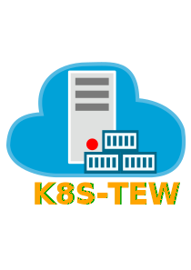

<p align="center"></p>

<p align="center"><a href="https://github.com/cncf/k8s-conformance/tree/master/v1.10/k8s-tew"></a><a href="https://github.com/cncf/k8s-conformance/tree/master/v1.11/k8s-tew"></a></p>

# Kubernetes - The Easier Way (k8s-tew)

k8s-tew is a CLI tool to install a [Kubernetes](https://kubernetes.io/) Cluster (local, single-node, multi-node or HA-cluster) on Bare Metal. It installs the most essential components needed by a cluster such as  networking, storage, monitoring, logging, backuping/restoring and so on. Besides that, k8s-tew is also a also a supervisor that starts all cluster components on each node.

## Why

Kubernetes is a fairly complex project. For a newbie it is hard to understand and also to use. While [Kelsey Hightower's Kubernetes The Hard Way](https://github.com/kelseyhightower/kubernetes-the-hard-way), on which this project is based, helps a lot to understand Kubernetes, it is optimized for the use with Google Cloud Platform.

Thus, this project's aim is to give newbies an easy to use tool that allows them to tinker with Kubernetes and later on to install HA production grade clusters.

# Features

* Multi node setup passes all CNCF conformance tests ([Kubernetes 1.10](https://github.com/cncf/k8s-conformance/tree/master/v1.10/k8s-tew), [Kubernetes 1.11](https://github.com/cncf/k8s-conformance/tree/master/v1.11/k8s-tew))
* Networking: [Calico](https://www.projectcalico.org) for
* Ingress: [NGINX Ingress](https://kubernetes.github.io/ingress-nginx/) and [cert-manager](http://docs.cert-manager.io/en/latest/) for [Let's Encrypt](https://letsencrypt.org/)
* Storage: [Ceph/RBD](https://ceph.com/)
* Metrics: [metering-metrics](https://github.com/kubernetes-incubator/metrics-server) and [Heapster](https://github.com/kubernetes/heapster)
* Monitoring: [Prometheus](https://prometheus.io/) and [Grafana](https://grafana.com/)
* Logging: [Fluent-Bit](https://fluentbit.io/), [Elasticsearch](https://www.elastic.co/), [Kibana](https://www.elastic.co/products/kibana) and [Cerebro](https://github.com/lmenezes/cerebro)
* Backups: [Ark](https://github.com/heptio/ark), [Restic](https://restic.net/) and [Minio](https://www.minio.io/)
* Package manager: [Helm](https://helm.sh/)
* Dashboard: [Kubernetes Dashboard](https://github.com/kubernetes/dashboard)
* The communication between the components is encrypted
* RBAC is enabled
* The controllers and the workers have Floating/Virtual IPs
* Integrated Load Balancer for the API Servers
* Support for deployment to a HA cluster using ssh
* Only the changed files are deployed
* No docker installation required (uses containerd)
* No cloud provider required
* Single binary without any dependencies
* Runs locally
* Nodes management from the command line
* Downloads all the used binaries (kubernetes, etcd, flanneld...) from the Internet
* Probably lower storage and RAM footprint compared to other solutions (kubespray, kubeadm, minikube...)
* Uses systemd to install itself as a service on the remote machine
* Installs [WordPress](https://wordpress.com) and [MySQL](https://www.mysql.com) to test drive the installation

# Install

The commands in the upcoming sections will assume that k8s-tew is going to be installed in the directory /usr/local/bin. That means that the aforementioned directory exists and it is included in the PATH. If that is not the case use the following commands:

```shell
sudo mkdir -p /usr/local/bin
export PATH=/usr/local/bin:$PATH
```

## From binary

The 64-bit binary can be downloaded from the following address: https://github.com/darxkies/k8s-tew/releases

Additionally the these commands can be used to download it and install it in /usr/local/bin

```shell
curl -s https://api.github.com/repos/darxkies/k8s-tew/releases/latest | grep "browser_download_url" | cut -d : -f 2,3 | tr -d \" | sudo wget -O /usr/local/bin/k8s-tew -qi -
sudo chmod a+x /usr/local/bin/k8s-tew
```

## From source

To compile it from source you will need a Go (version 1.10+) environment and Git installed. Once Go is configured, enter the following commands:

```shell
export GOPATH=~/go
mkdir -p $GOPATH
go get github.com/darxkies/k8s-tew
cd ~/go/src/github.com/darxkies/k8s-tew
make
sudo mv ~/go/bin/k8s-tew /usr/local/bin
```

# Requirements

k8s-tew was tested so far on Ubuntu 18.04 and CentOS 7.5. But it should be able to run on other Linux distributions.

On each Ubuntu 18.04 node the following commands have to be executed:

```shell
apt-get update
apt-get install -y apt-transport-https socat conntrack ipset ceph-common
```

And for Centos 7.5:

```shell
setenforce 0
sed -i --follow-symlinks 's/SELINUX=enforcing/SELINUX=disabled/g' /etc/sysconfig/selinux

sudo systemctl disable firewalld
sudo systemctl stop firewalld

yum install -y yum-utils && sudo yum-config-manager --add-repo https://dl.fedoraproject.org/pub/epel/7/x86_64/ && sudo yum install --nogpgcheck -y epel-release && sudo rpm --import /etc/pki/rpm-gpg/RPM-GPG-KEY-EPEL-7 && sudo rm /etc/yum.repos.d/dl.fedoraproject.org*

cat <<EOF > /etc/yum.repos.d/ceph.repo
[ceph]
name=Ceph packages for $basearch
baseurl=https://download.ceph.com/rpm-luminous/el7/x86_64/
enabled=1
priority=2
gpgcheck=1
gpgkey=https://download.ceph.com/keys/release.asc
EOF

yum install socat conntrack ipset ceph-common -y
```

# Usage

All k8s-tew commands accept the argument --base-directory, which defines where all the files (binaries, certificates, configurations and so on) will be stored. If no value is defined then it will create a subdirectory called "assets" in the working directory. Additionally, the environment variable K8S_TEW_BASE_DIRECTORY can be set to point to the assets directory instead of using --base-directory.

To see all the commands and their arguments use the -h argument.

## Initialization

The first step in using k8s-tew is to create a config file. This is achieved by executing this command:

```shell
  k8s-tew initialize
```

That command generates the config file called assets/etc/k8s-tew/config.yaml. To overwrite the existing configuration use the argument -f.

## Configuration

After the initialization step the parameters of the cluster should be be adapted. These are the configure parameters and their defaults:

* --apiserver-port - API Server Port (default 6443)
* --ca-certificate-validity-period - CA Certificat eValidity Period (default 20)
* --client-validity-period - Client Certificate Validity Period (default 15)
* --cluster-cidr - Cluster CIDR (default "10.200.0.0/16")
* --cluster-dns-ip - Cluster DNS IP (default "10.32.0.10")
* --cluster-domain - Cluster domain (default "cluster.local")
* --cluster-ip-range - Cluster IP range (default "10.32.0.0/24")
* --controller-virtual-ip - Controller Virtual/Floating IP for the cluster
* --controller-virtual-ip-interface - Controller Virtual/Floating IP interface for the cluster
* --dashboard-port - Dashboard Port (default 32443)
* --deployment-directory - Deployment directory (default "/")
* --email - Email address used for example for Let's Encrypt (default "k8s-tew@gmail.com")
* --ingress-domain - Ingress domain name (default "k8s-tew.net")
* --load-balancer-port - Load Balancer Port (default 16443)
* --public-network - Public Network (default "192.168.0.0/24")
* --resolv-conf - Custom resolv.conf (default "/etc/resolv.conf")
* --rsa-key-size - RSA Key Size (default 2048)
* --version-ark - Ark version (default "0.9.3")
* --version-containerd - Containerd version (default "1.1.2")
* --version-crictl - CriCtl version (default "1.11.1")
* --version-etcd - Etcd version (default "3.3.7")
* --version-gobetween - Gobetween version (default "0.5.0")
* --version-helm - Helm version (default "2.9.1")
* --version-k8s - Kubernetes version (default "1.11.2")
* --version-minio-client - Minio client version (default "RELEASE.2018-08-18T02-13-04Z")
* --version-minio-server- Minio server version (default "RELEASE.2018-08-18T03-49-57Z")
* --version-runc - Runc version (default "1.0.0-rc5")
* --worker-virtual-ip - Worker Virtual/Floating IP for the cluster
* --worker-virtual-ip-interface - Worker Virtual/Floating IP interface for the cluster

The email and the ingress-domain parameters need to be changed if you want a working Ingress and Lets' Encrypt configuration. It goes like this:

```shell
k8s-tew configure --email john.doe@gmail.com --ingress-domain example.com
```

Another important argument is --resolv-conf which is used to define which resolv.conf file should be used for DNS.

The Virtual/Floating IP parameters should be accordingly changed if you want true HA. This is especially for the controllers important. Then if there are for example three controllers then the IP of the first controller is used by the whole cluster and if that one fails then the whole cluster will stop working. k8s-tew uses [etcd](https://coreos.com/etcd/) and its [RAFT](https://raft.github.io/) functionality to keep track of the available nodes and if the current leader fails, its Virtual IP is passed automatically to another node.

## Labels

k8s-tew uses labels to specify which files belong on a node, which commands should be executed on a node and also which components need to be started on a node. They are similar to Kubernetes' Labels and Selectors.

* bootstrapper - This label marks bootstrapping node/commands
* controller - Kubernetes Controler. At least three controller nodes are required for a HA cluster.
* worker - Kubernetes Node/Minion. At least one worker node is required.
* storage - The storage manager components are installed on the controller nodes. The worker nodes are used to store the actual data of the pods. If the storage label is omitted then all nodes are used. If you choose to use only some nodes for storage, then keep in mind that you need at least three storage managers and at least two data storage servers for a HA cluster.

## Nodes

So far the configuration has no nodes defined yet.

### Add Remote Node

A remote node can be added with the following command:

```shell
k8s-tew node-add -n controller00 -i 192.168.100.100 -x 0 -l controller
```

The arguments:

* -n - The name of the node. This name has to match the hostname of that node.
* -i - The IP of the node
* -x - Each node needs a unique number. Do not reuse this number even though the node does not exist anymore.
* -l - The role of the node in the cluster: controller and/or worker and/or storage

### Add Local Node
k8s-tew is also able to start a cluster on the local computer and for that the local computer has to be added as a node:

```shell
k8s-tew node-add -s
```

The arguments:

* -s - it overrides the previously described flags by overwriting the name and the ip after inferring them.

### Remove Node

A node can be removed like this:

```shell
k8s-tew node-remove -n controller00
```
### List Nodes

And all the nodes can be listed with the command:

```shell
k8s-tew node-list
```

## Generating Files

Once all the nodes were added, the required files (third party binares, certificates, kubeconfigs and so on) have to be put in place. And this goes like this:

```shell
k8s-tew generate
```

## Run

With this command the local cluster can be started:

```shell
k8s-tew run
```

## Deploy

In case remote nodes were added with the deploy command, the remotely missing files are copied to the nodes. k8s-tew is installed and started as a service.

The deployment is executed with the command:

```shell
k8s-tew deploy
```

The files are copied using scp and the ssh private key $HOME/.ssh/id_rsa. In case the file  $HOME/.ssh/id_rsa does not exist it should be generated using the command ssh-keygen. If another private key should be used, it can be specified using the command line argument -i.

## Environment

After starting the cluster, the user will need some environment variables set locally to make the interaction with the cluster easier. This is done with this command:

```shell
eval $(k8s-tew environment)
```

## Kubernetes Dashboard

k8s-tew also installs the Kubernetes Dashboard. Invoke the command to display the admin token:

```shell
k8s-tew dashboard
```

If you have a GUI web browser installed, then you can use the following command to display the admin token for three seconds, enough time to copy the token, and to also open the web browser:

```shell
k8s-tew dashboard -o
```

__NOTE__: It takes minutes to actually download dashboard. Use the following command to check the status of the pods:

```shell
kubectl get pods -n kube-system
```

Once the pod is running the dashboard can be accessed through the TCP port 32443. Regarding the IP address, use the IP address of a worker node or the worker Virtual IP if one was specified.

When asked to login, enter the admin token.

# Cluster Setups

Vagrant/VirtualBox can be used to test drive k8s-tew. The host is used to bootstrap the cluster which runs in VirtualBox. The Vagrantfile included in the repository can be used for single-node/multi-node & Ubuntu 18.04/CentOS 7 setups.

The Vagrantfile can be configured using the environment variables:

* OS - define the operating system. It accepts ubuntu and centos.
* MULTI_NODE - if set then a HA cluster is generated. Otherwise a single-node setup is used.
* CONTROLLERS - defines the number of controller nodes. The default number is 3.
* WORKERS - specifies the number of worker nodes. The default number is 2.

__NOTE__: The multi-node setup with the default settings needs about 16GB RAM for itself.

## Ubuntu Single-Node

Steps to generate a single-node / Ubuntu cluster:

```shell
# Create the single-node VM
vagrant destroy single-node -f
OS=ubuntu vagrant up

# Create the assets and deploy them
k8s-tew initialize -f
k8s-tew configure --controller-virtual-ip=192.168.100.10 --controller-virtual-ip-interface=enp0s8 --worker-virtual-ip=192.168.100.20 --worker-virtual-ip-interface=enp0s8 --resolv-conf=/run/systemd/resolve/resolv.conf
k8s-tew node-add -n single-node -i 192.168.100.50 -x 0 -l controller,worker
k8s-tew generate --deployment-directory=/
k8s-tew deploy

# Setup local environment to execute kubectl, helm, etcdcl and so on
eval $(k8s-tew environment)

# Get token for Kubernetes Dashboard
kubectl -n kube-system describe secret $(kubectl -n kube-system get secret | grep admin-user | awk '{print $1}') | grep token: | awk '{print $2}'

# Access Kubernetes dashboard
xdg-open https://192.168.100.20:32443
```

## Ubuntu Multi-Node

Steps to generate a multi-node / Ubuntu cluster:

```shell
# Create the multi-node VM (3 controllers & 2 workers)
OS=ubuntu MULTI_NODE=true vagrant destroy -f
OS=ubuntu MULTI_NODE=true vagrant up

# Create the assets and deploy them
k8s-tew initialize -f
k8s-tew configure --controller-virtual-ip=192.168.100.10 --controller-virtual-ip-interface=enp0s8 --worker-virtual-ip=192.168.100.20 --worker-virtual-ip-interface=enp0s8 --resolv-conf=/run/systemd/resolve/resolv.conf
k8s-tew node-add -n controller00 -i 192.168.100.100 -x 0 -l controller
k8s-tew node-add -n controller01 -i 192.168.100.101 -x 1 -l controller
k8s-tew node-add -n controller02 -i 192.168.100.102 -x 2 -l controller
k8s-tew node-add -n worker00 -i 192.168.100.200 -x 3 -l worker
k8s-tew node-add -n worker01 -i 192.168.100.201 -x 4 -l worker
k8s-tew generate --deployment-directory=/
k8s-tew deploy

# Setup local environment to execute kubectl, helm, etcdcl and so on
eval $(k8s-tew environment)

# Get token for Kubernetes Dashboard
kubectl -n kube-system describe secret $(kubectl -n kube-system get secret | grep admin-user | awk '{print $1}') | grep token: | awk '{print $2}'

# Access Kubernetes dashboard
xdg-open https://192.168.100.20:32443
```

## Local

This steps can be used to get k8s-tew to run locally without any virtual machine.

```shell
k8s-tew initialize -f
k8s-tew node-add -s
k8s-tew generate
sudo k8s-tew run
```

__NOTE__: To access Kuberntes Dashboard use the internal IP address and 127.0.0.1/localhost. Depending on the hardware used, it might take a while until it starts and setups everything.

# Troubleshooting

k8s-tew enables logging for all components by default. The log files are stored in {base-directory}/var/log/k8s-tew/.

# Caveats

* k8s-tew needs root privileges to be executed. Thus, it should be executed on a virtual machine or in a Docker container to generate the assets and to deploy the cluster.

# Feedback

* Gmail: darxkies@gmail.com
